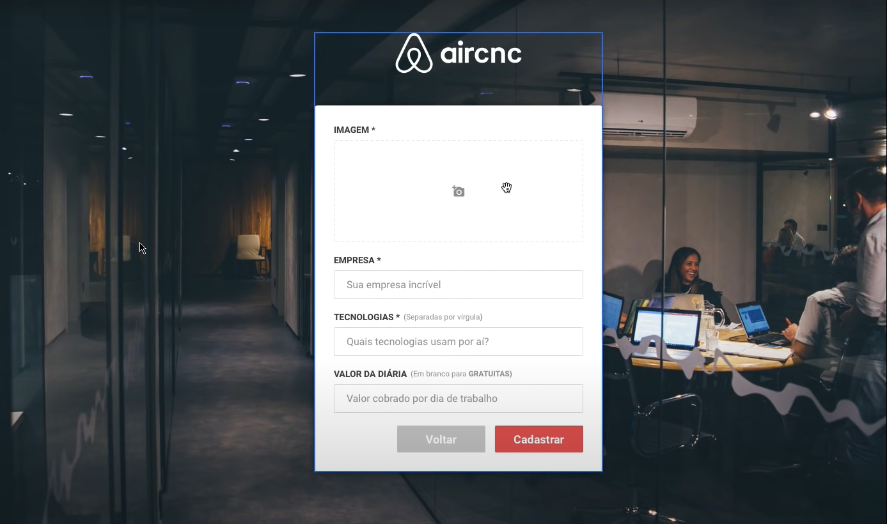

# AirCnc
> A simple application to help Coders connect with companies through office rooms reservations.

This application was developed in Javascript using Node JS and React JS.



## Installation


```sh
yarn add 
```


```sh
make install nodemon -D
npm test
```

## Meta

Fellipe F Lopes – [https://www.linkedin.com/in/fellipeflopes/](Linkedin)
